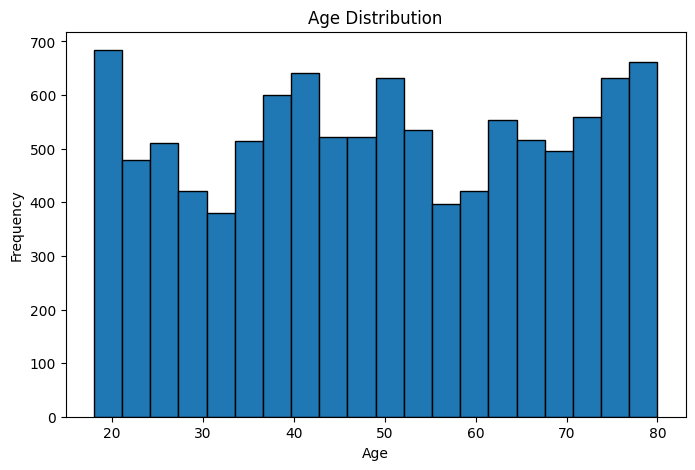
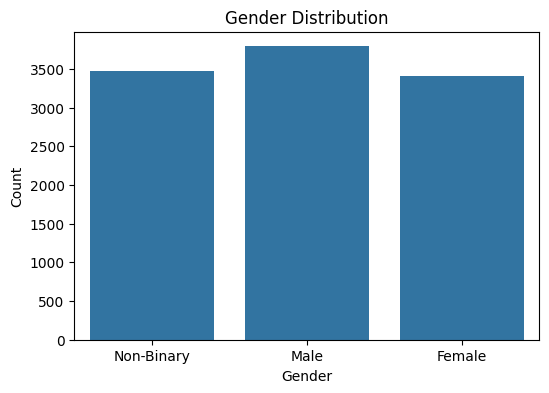
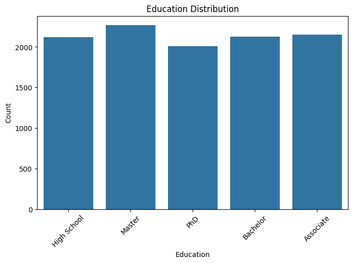
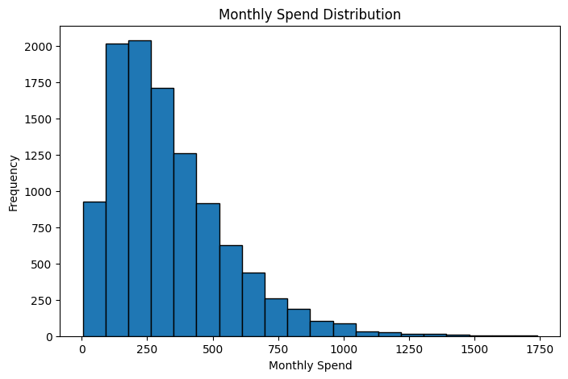
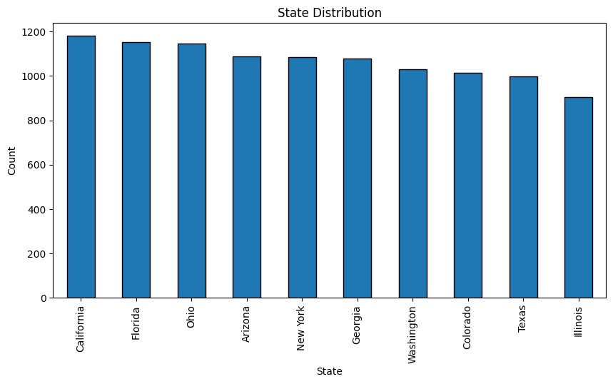
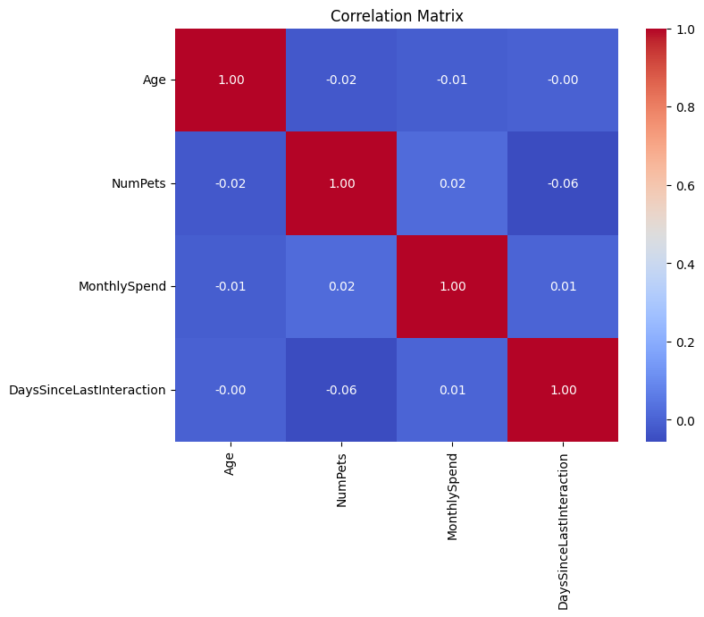
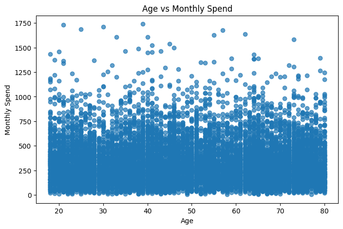

# 📊 Customer Insights Analysis Using Python


## 📌 Project Overview

This project performs an end-to-end **Customer Insights Analysis** using Python. The analysis explores customer demographics, purchasing behavior, and spending patterns through **Exploratory Data Analysis (EDA)**, descriptive statistics, data visualization, and hypothesis testing.

The goal is to uncover meaningful business insights that can help organizations better understand their customers and support data-driven decision-making.

---

## 🎯 Objectives

- Clean and explore customer data
- Perform descriptive statistical analysis
- Visualize demographic and spending patterns
- Identify relationships between variables
- Apply hypothesis testing using SciPy
- Generate actionable business insights

---

## 📂 Dataset

**Dataset:** `US_Customer_Insights_Dataset.csv`

The dataset contains customer information such as:

- Customer ID
- Age
- Gender
- Education
- State
- Monthly Spending
- Purchase Behavior
- Other demographic and behavioral attributes

---

## 🛠️ Technologies Used

- Python
- Pandas
- Matplotlib
- Seaborn
- SciPy
- Jupyter Notebook

---

## 📁 Project Structure

```text
Customer-Insights-Statistics-Project/
│
├── data/
│   └── US_Customer_Insights_Dataset.csv
│
├── notebook/
│   └── Customer_Insights_Analysis.ipynb
│
├── images/
│   ├── age_distribution.png
│   ├── gender_distribution.png
│   ├── education_distribution.png
│   ├── monthly_spend_distribution.png
│   ├── state_distribution.png
│   ├── correlation_heatmap.png
│   └── age_vs_monthly_spend.png
│
├── README.md
├── requirements.txt
└── LICENSE
```

---

# 📊 Visualizations

## Age Distribution



---

## Gender Distribution



---

## Education Distribution



---

## Monthly Spending Distribution



---

## State Distribution



---

## Correlation Heatmap



---

## Age vs Monthly Spending



---

# 📈 Analysis Performed

- Data Loading
- Data Cleaning
- Exploratory Data Analysis (EDA)
- Descriptive Statistics
- Distribution Analysis
- Correlation Analysis
- Customer Demographics Analysis
- Spending Pattern Analysis
- Hypothesis Testing
- Business Insights

---

# 📌 Key Insights

- Customer age distribution highlights the dominant age groups.
- Monthly spending varies significantly across customers.
- Education levels influence purchasing behavior.
- Geographic distribution reveals customer concentration by state.
- Correlation analysis identifies relationships among numerical variables.
- Statistical testing validates business assumptions using hypothesis testing.

---

# 🚀 How to Run

### Clone Repository

```bash
git clone  https://github.com/knoxwave/Customer-Insights-Statistics-Project.git
```

### Install Dependencies

```bash
pip install -r requirements.txt
```

### Launch Jupyter Notebook

```bash
jupyter notebook
```

Open:

```text
Customer_Insights_Analysis.ipynb
```

---

## 📦 Requirements

```text
pandas
matplotlib
seaborn
scipy
jupyter
```

---

## 🎯 Skills Demonstrated

- Data Cleaning
- Exploratory Data Analysis
- Data Visualization
- Descriptive Statistics
- Hypothesis Testing
- Business Analytics
- Python Programming
- Statistical Analysis

---

## 📄 License

This project is licensed under the MIT License.

---

## 👨‍💻 Author

**Ajit Kumar**

- 🎓 M.Sc (IT)
- 📍 Koderma, Jharkhand, India
- 💼 Aspiring Data Analyst

### Connect with Me

- GitHub: https://github.com/knoxwave
- LinkedIn: https://www.linkedin.com/in/ajit-kumar-950039128/

---

⭐ If you found this project helpful, consider giving it a **Star** on GitHub!
